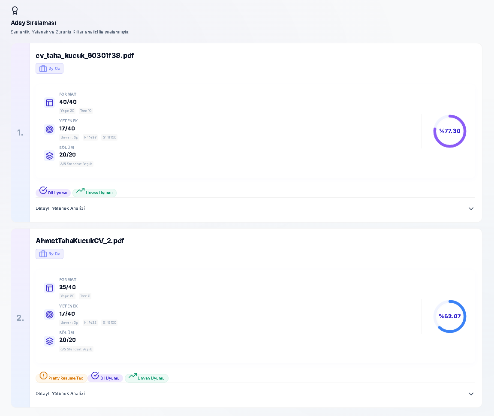
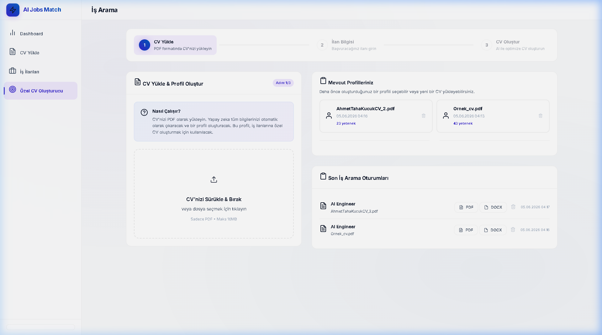
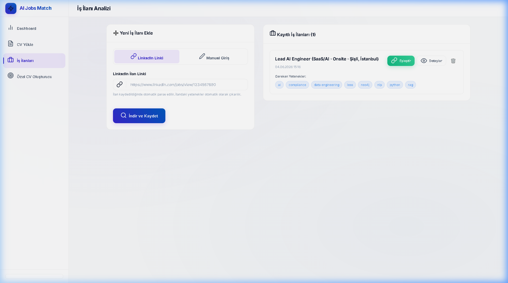
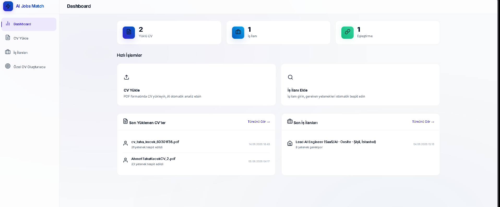

# HireLens - Intelligent Semantic Screening & CV Optimization Platform

[](https://www.python.org/)
[](https://flask.palletsprojects.com/)
[](https://sbert.net/)
[](https://spacy.io/)
[](https://sqlite.org/)
[](LICENSE)
[](README_TR.md)

HireLens is a privacy-focused, local-first Applicant Tracking System (ATS) and Resume Tailoring engine. The platform employs Sentence-BERT embeddings and spaCy entity recognition to facilitate context-aware, semantic screening and formatting audits without relying on external cloud LLM APIs.


---

## Table of Contents
1. [Project Architecture](#project-architecture)
2. [Key Features](#key-features)
3. [Technology Stack](#technology-stack)
4. [Interface Previews](#interface-previews)
5. [Step-by-Step Installation Guide](#step-by-step-installation-guide)
6. [How to Run](#how-to-run)
7. [Database Schema](#database-schema)
8. [Codebase Annotations (Turkish Notes)](#codebase-annotations-turkish-notes)
9. [License](#license)

---

## Project Architecture

The application is structured as a two-sided marketplace dashboard:

```
[Candidate Portal]               [Recruiter Portal]
        │                                │
        ▼                                ▼
┌────────────────────────────────────────────────────────┐
│                      Flask App                         │
└──────────────────────────┬─────────────────────────────┘
                           │
        ┌──────────────────┴──────────────────┐
        ▼                                     ▼
┌──────────────┐                       ┌──────────────┐
│  NLP Engine  │                       │ File Parser  │
│  - SBERT     │                       │ - PyMuPDF    │
│  - spaCy NER │                       │ - python-docx│
└──────┬───────┘                       └──────┬───────┘
       │                                      │
       └──────────────────┬───────────────────┘
                          ▼
                  ┌──────────────┐
                  │ SQLite DB    │
                  │ - Embeddings │
                  │ - Gaps / ATS │
                  └──────────────┘
```

---

## Key Features

### 1. Dual-Sided Platform Mappings
* **Recruiter Panel:** Allows hiring teams to upload job descriptions, parse them for requirements, automatically ingest candidate folders, and view semantically ranked shortlists.
* **Candidate Panel:** Enables applicants to upload their resumes, run a scorecard assessment against target job postings, view their formatting/skill warnings, and output an optimized ATS-friendly PDF.

### 2. Semantic screening vs. Lexical Filters
Unlike traditional keyword-matching systems that penalize synonyms (e.g., rejecting "Deep Learning" when searching for "Neural Networks"), this engine uses Sentence-BERT (`paraphrase-multilingual-MiniLM-L12-v2`) to project resumes and jobs into a shared 384-dimensional vector space. Eşleşme skoru, iki vektör arasındaki **Kosinüs Benzerliği (Cosine Similarity)** ile hesaplanır.

### 3. Scorecard 4.0 Assessment Model
Each resume is graded out of **100 points** based on four distinct metrics:
* **Format & Visual Integrity (Max 40 points):** Detects multi-column layouts (Canva templates) which often scramble parsing. Applies a **15-point visual tax penalty** for double-column layouts and **-4 points** for PDF warning markers (missing email, phone number, etc.).
* **Section Complete (Max 20 points):** Confirms the semantic presence of standard resume zones (Summary, Experience, Education, Skills, and Certifications). Each section adds **+4 points**.
* **Keyword & Skill Alignment (Max 40 points):** Combines role alignment (last job title matched to target vacancy title via SBERT) and technical/soft skills density.
* **Disqualification Factor:** If critical "Must-Have" skills are missing, a multiplier is triggered, decreasing the score by **25% per missing skill** down to a floor of **0.2**.
* **Language Match Penalty:** Deducts **10%** if the resume language doesn't align with the job description language.

### 4. Dynamic Column-Split Algorithm
Standard PDF parsers read text left-to-right across the page coordinate system, merging multi-column text lines into unreadable sequences. This engine implements a **Crossing Index Minimization Gutter Finder** that dynamically splits pages into independent vertical blocks, ensuring sequential parsing of sidebars and main content.

### 5. Extractive CV Optimizer
Instead of generative LLMs that are prone to hallucinating facts (making up projects or experiences to match descriptions), this platform uses an **extractive approach**. It processes the candidate's actual, verified bullet points, ranks them according to their semantic relevance to the job specification, moves the most relevant bullet points to the top, and compiles a standard, single-column PDF using **ReportLab**.

---

## Technology Stack
* **Web Framework:** Flask 3.0+
* **Semantic Embeddings:** SentenceTransformers (SBERT)
* **Natural Language Parsing & NER:** spaCy (with customized EntityRuler)
* **Document Extraction:** PyMuPDF (fitz), python-docx
* **PDF Compilation:** ReportLab
* **Database Engine:** SQLite (configured in high-concurrency WAL mode)

---

## Interface Previews

### Recruiter Shortlisting & Ranking Dashboard

*Semantically screened profiles sorted by compatibility with detailed skills gaps visualization.*

### Candidate Portal & Upload Scorecard

*Resume feedback detailing structure warnings, missing must-have keywords, and optimization notes.*

### Job Requirements Extractor

*Detailed ingestion of LinkedIn URL vacancies separating Must-Have and Nice-to-Have parameters.*

### Main Portal Hub

*A consolidated operational overview displaying candidate uploads and job listings.*

---

## Step-by-Step Installation Guide

This guide is designed to help anyone (even without technical programming experience) set up and run the application locally on **Windows**.

### Phase 1: Install Python
1. Download **Python 3.10** or newer from the official site: [Python Downloads](https://www.python.org/downloads/).
2. Run the installer.
3. **IMPORTANT:** On the very first window of the installer, check the box that says **"Add python.exe to PATH"**. If you skip this, the console commands will not work.
4. Complete the installation wizard.

### Phase 2: Clone and Navigate to the Repository
1. Clone the repository using Git (or download and extract the ZIP file):
   ```cmd
   git clone https://github.com/tahakckk/HireLens.git
   ```
2. Open your terminal or Command Prompt, and navigate to the project directory:
   ```cmd
   cd HireLens
   ```

### Phase 3: Create a Virtual Environment (Recommended)
This isolates the project requirements from your global computer packages:
```cmd
python -m venv venv
```

To activate the virtual environment:
```cmd
venv\Scripts\activate
```
*(Your command line prompt will now show `(venv)` at the beginning, indicating activation).*

### Phase 4: Install Dependencies
Install all required libraries automatically:
```cmd
pip install -r requirements.txt
```
*(This process may take 2-4 minutes as it downloads and configures data processing packages like PyMuPDF, spaCy, and SentenceTransformers).*

### Phase 5: Download spaCy Model
Run the command below to fetch the pre-trained NLP model:
```cmd
python -m spacy download en_core_web_sm
```

---

## How to Run

1. Make sure your virtual environment is active (shows `(venv)` in the terminal).
2. Set a unique, random `SECRET_KEY` of at least 32 characters in the application environment before starting the server. `.env.example` documents the required variable, but `python app.py` does not load `.env` automatically; do not commit a real secret.
3. Start the local server:
   ```cmd
   python app.py
   ```
4. You will see output similar to this:
   ```
   ==================================================
     HireLens - Semantic Talent Matcher & ATS Engine
     Server running at: http://localhost:5000
   ==================================================
   ```
5. Open your browser (Google Chrome, Edge, Safari, Firefox) and go to:
   [http://localhost:5000](http://localhost:5000)

---

## Database Schema

The SQLite schema initializes automatically on first startup. It contains the following tables:

* **`cvs`:** Stores parsed resumes, metadata, chronological timelines, experience metrics, and SBERT binary embeddings (stored as `BLOB`).
* **`jobs`:** Stores parsed requirements, target skills (must-have vs. nice-to-have), and vacancy SBERT embeddings.
* **`matches`:** Saves historical matching metrics, calculated visual format scores, missing requirement lists, language flags, and final compatibility percentages.
* **`user_profiles`:** Connects candidates' base profile data (experiences, education histories, skill trees).
* **`job_search_sessions`:** Logs active resume optimizations, tracking target job details and generated PDF structures.

---

## Codebase Annotations (Turkish Notes)

For academic evaluations, presentations, and code defenses, all long comments and complex developer docstrings have been stripped. In their place, **short Turkish annotations (prefixed with `# NOT:`)** have been added to the critical sections of the code. 

These notes serve as personal presentation highlights, explaining:
* How the **WAL (Write-Ahead Logging)** concurrency mode is enabled on the SQLite handle in `app.py`.
* The **Crossing Index Gutter splitting logic** in `file_parser.py`.
* SBERT **embedding encoding** and **Cosine Similarity scaling** in `nlp_engine.py`.
* The **Scorecard 4.0 visual tax penalties** and **Must-Have coefficients** in `nlp_engine.py`.
* The **hallucination-free extractive sentence ranking weights** in `extractive_cv.py`.

---

## License

Distributed under the MIT License. See `LICENSE` for more information.

## Development, Testing, and Deployment

Set `SECRET_KEY` to a unique value of at least 32 characters before any process starts. Development uses the safe default (debug disabled unless explicitly changed in your own configuration):

```bash
export SECRET_KEY='replace-with-a-unique-secret-of-at-least-32-characters'
python app.py
```

Run the automated checks without downloading NLP models; the factory accepts injected model services in tests:

```bash
ruff check app.py database.py services.py tests/test_architecture.py
pytest -q
```

For production, serve the dedicated WSGI entry point rather than Flask's development server:

```bash
gunicorn wsgi:app
```

`create_app()` owns application setup, registers the `recruiter` and `job_search` blueprints, initializes SQLite idempotently, and starts NLP services only when an application instance is created. SQLite connections are scoped to the Flask application context with foreign keys and WAL enabled. Existing `database.db` data is retained; schema upgrades add only missing columns.
